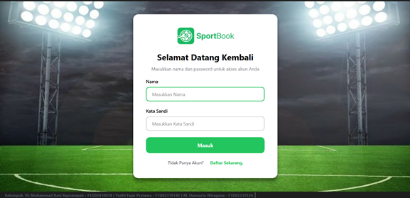
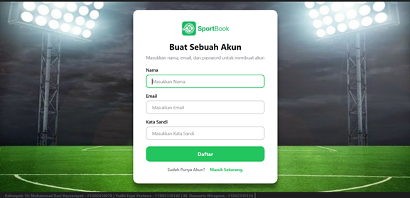
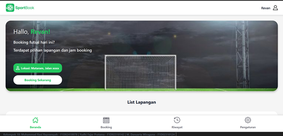
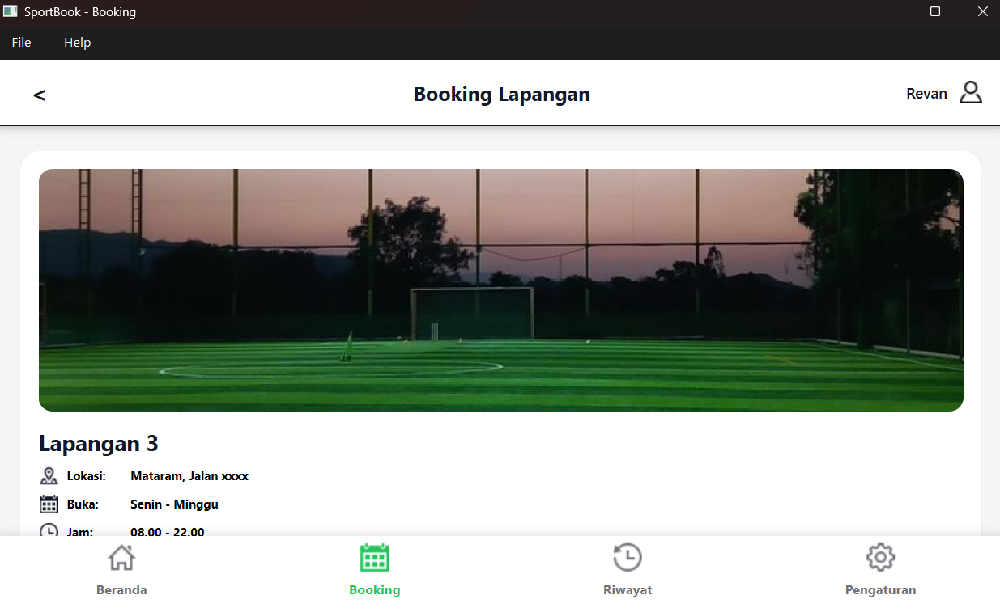
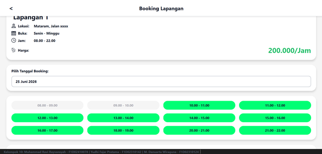
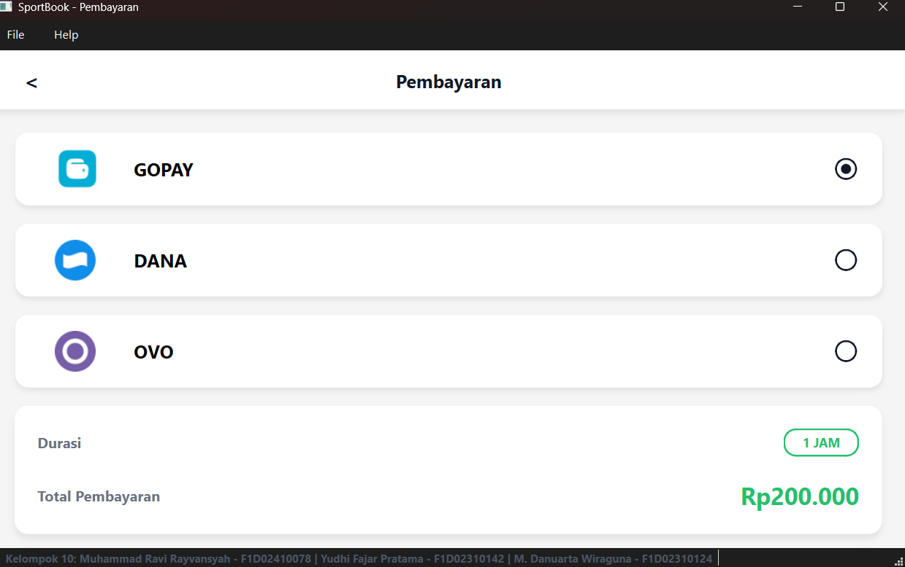
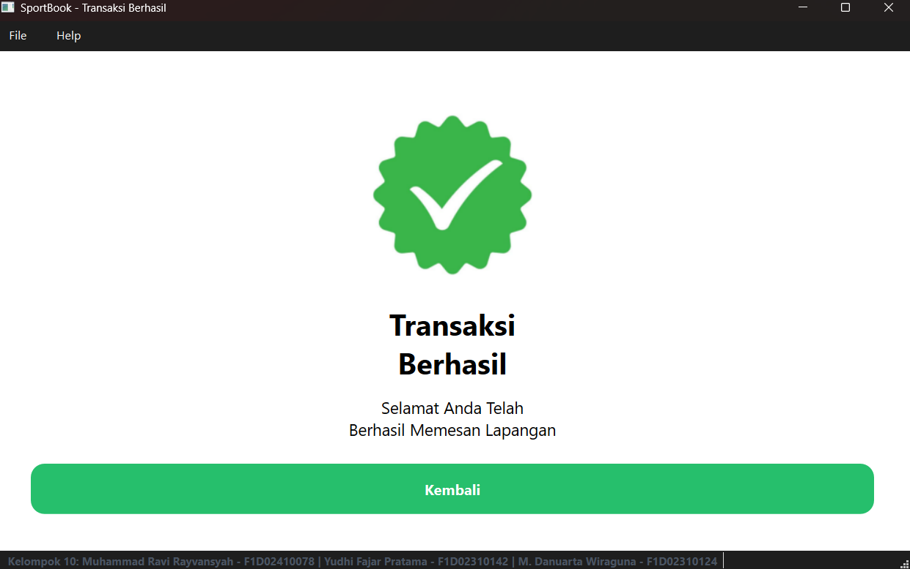
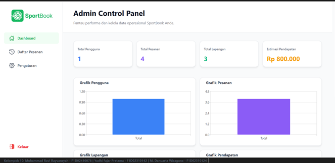
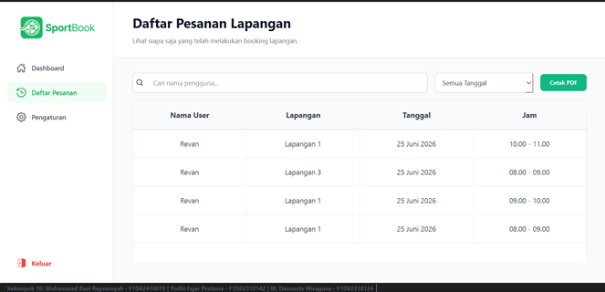
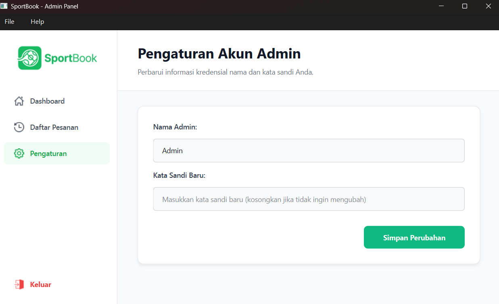

# SportBook

## Aplikasi Pemesanan Lapangan Olahraga Desktop Berbasis PySide6

### Deskripsi Singkat

SportBook adalah aplikasi desktop yang dikembangkan menggunakan Python dan PySide6 untuk memudahkan proses pemesanan lapangan olahraga. Aplikasi ini menyediakan fitur registrasi dan login pengguna, pemesanan lapangan berdasarkan slot waktu, simulasi pembayaran, riwayat pemesanan, pengaturan akun, serta panel administrasi untuk mengelola data booking dan melihat statistik penggunaan.

### Fitur Utama

* Login dan registrasi akun
* Sistem autentikasi User dan Admin
* Pemesanan lapangan olahraga
* Pemilihan slot waktu yang tersedia
* Simulasi pembayaran (GoPay, OVO, DANA)
* Riwayat pemesanan
* Pengaturan akun pengguna
* Dashboard Admin dengan statistik dan grafik
* Manajemen booking oleh Admin
* Export data booking ke CSV
* Database SQLite

---

## Anggota Kelompok

| Nama                     | NIM         |
| ------------------------ | ----------- |
| Muhammad Ravi Rayvansyah | F1D02410078 |
| Yudhi Fajar Pratama      | F1D02310142 |
| M. Danuarta Wiraguna     | F1D02310124 |

---

## Cara Menjalankan Program

### 1. Clone Repository

```bash
git clone <url-repository>
cd SportBook
```

### 2. Install Dependency

```bash
pip install PySide6
pip install PySide6-Charts
pip install pandas
pip install fpdf
```

Atau:

```bash
pip install -r requirements.txt
```

### 3. Jalankan Aplikasi

```bash
python main.py
```

### 4. Login

#### Admin

Admin
234567

#### User

Lakukan registrasi terlebih dahulu melalui menu Register.

---

## Struktur Folder

```text
SportBook/
│
├── assets/
├── database/
│   ├── sportbook.db
│   └── db_manager.py
│
├── styles/
│   └── style.qss
│
├── ui/
│   ├── login.py
│   ├── register.py
│   ├── beranda.py
│   ├── booking.py
│   ├── detail_booking.py
│   ├── pembayaran.py
│   ├── notif_sukses.py
│   ├── history.py
│   ├── pengaturan.py
│   ├── admin_dashboard.py
│   ├── admin_manage_bookings.py
│   ├── admin_sidebar.py
│   └── admin_pengaturan.py
│
└── main.py
```

---

## Screenshot Aplikasi

### Login


### Register


### Beranda


### Booking Lapangan


### Detail Booking


### Pembayaran


### Notifikasi Sukses


### Dashboard Admin


### Daftar Pemesanan Admin


### Pengaturan Akun


---

## Pembagian Tugas

### Muhammad Ravi Rayvansyah (F1D02410078)

* database/db_manager.py
* main.py
* ui/login.py
* ui/register.py
* ui/beranda.py
* ui/history.py
* ui/pengaturan.py

### Yudhi Fajar Pratama (F1D02310142) dan M. Danuarta Wiraguna (F1D02310124)

* ui/admin_sidebar.py
* ui/admin_pengaturan.py
* ui/admin_dashboard.py
* ui/admin_manage_bookings.py

---

## Teknologi yang Digunakan

* Python
* PySide6
* QtCharts
* SQLite
* Pandas
* FPDF

---

## Mata Kuliah

Pemrograman Visual
Program Studi Teknik Informatika
Fakultas Teknik
Universitas Mataram
Tahun 2026
